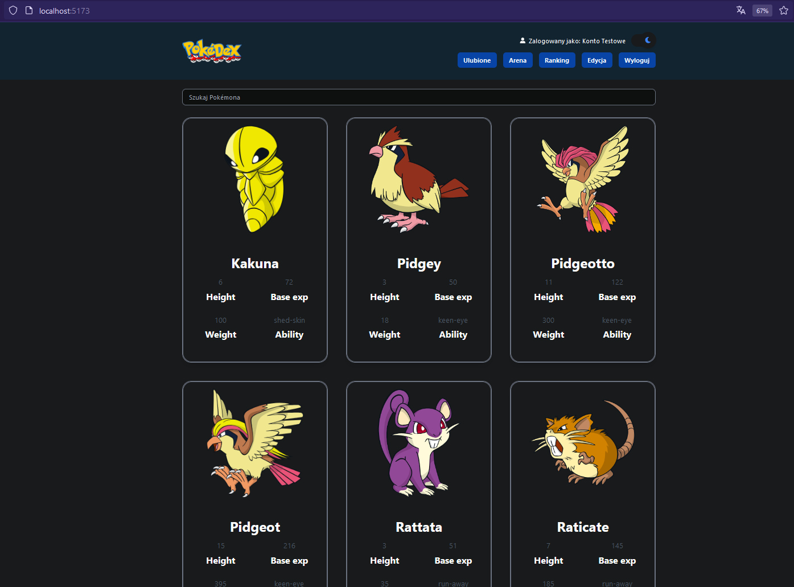
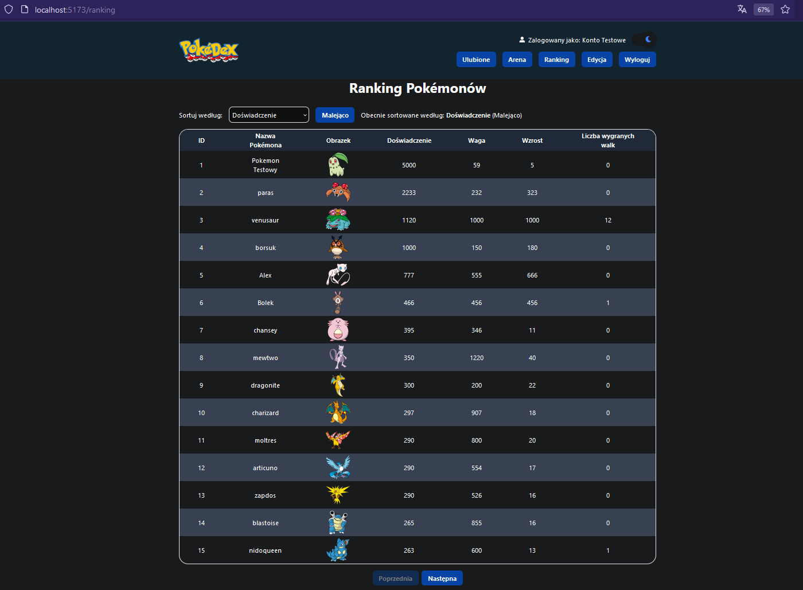
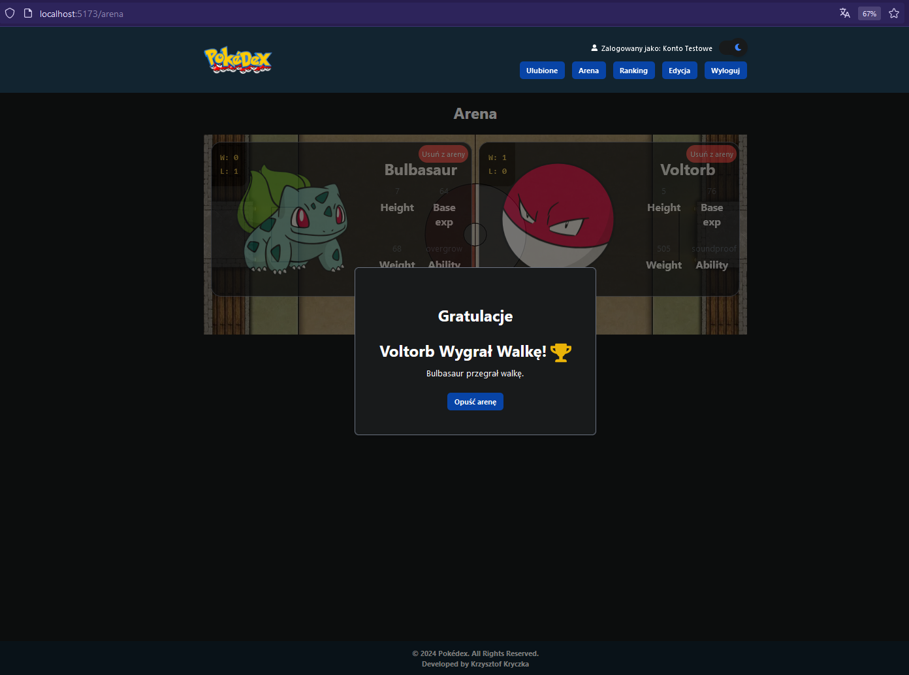
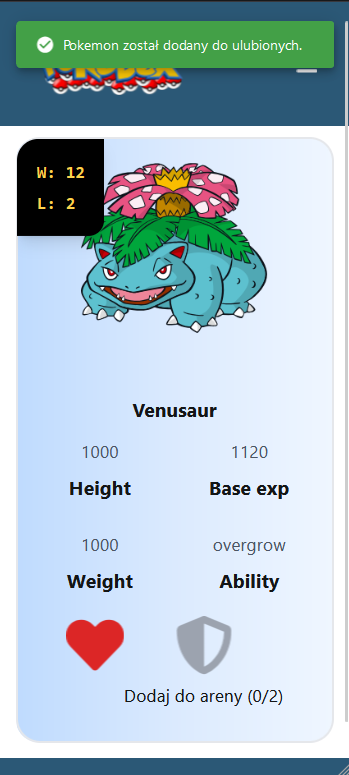
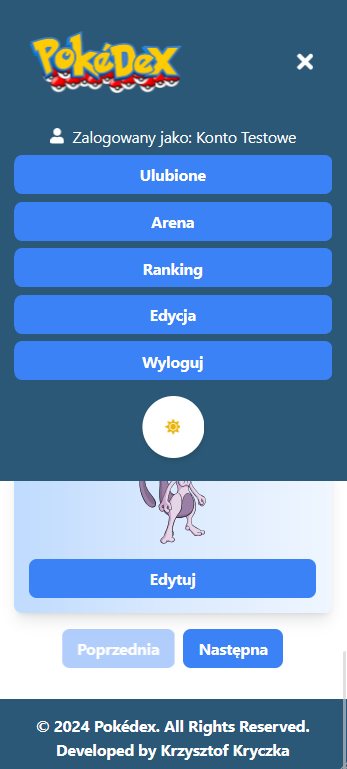

## Spis treści

-  [Funkcje](#funkcje)
-  [Instalacja](#instalacja)
-  [Struktura Projektu](#struktura-projektu)
-  [Struktura Katalogów](#struktura-katalogów)
-  [Technologie](#technologie)
-  [Komponenty](#komponenty)
-  [Strony](#strony)
-  [Hooki](#hooki)
-  [Konteksty](#konteksty)
-  [Zrzuty ekranu](#zrzuty-ekranu)

# Pokémon Manager (PokeDex)

Pokémon Manager to aplikacja do zarządzania Pokémonami, która umożliwia przeglądanie, dodawanie nowych, edytowanie istniejących Pokémonów oraz zarządzanie walkami Pokémonów na arenie.

## Funkcje

-  **Przeglądanie Pokémonów**: Przeglądaj listę dostępnych Pokémonów, zarówno lokalnych, jak i tych pobieranych z zewnętrznego API (limit 150 szt).
-  **Dodawanie Pokémonów**: Dodawaj nowe Pokémony do lokalnej bazy danych.
-  **Edytowanie Pokémonów**: Edytuj istniejące Pokémony i aktualizuj ich atrybuty.
-  **Zarządzanie Areną**: Dodawaj i usuwaj Pokémony z areny walk.
-  **Dodawanie do ulubionych**: Dodawaj swoje ulubione Pokémony do listy. Możesz je także usuwać. Każdy użytkownik po zalogowaniu ma dostęp do własnej listy ulubionych pokemonów.

## Instalacja

1. Sklonuj repozytorium:

```bash
$ git clone https://github.com/krzysztof-kryczka/Pokedex.git
```

2. Przejdź do katalogu projektu:

```bash
$ cd pokedex
```

3. Wybierz odpowiednią gałąź:

```bash
$ git branch -a
$ git switch nazwa_gałęzi
lub jesli wolisz archaiczne rozwiązanie to:
$ git checkout nazwa_gałęzi
```

4. Zainstaluj zależności:

```bash
$ npm install
```

5. Uruchamianie Aplikacji

```bash
$ npm run dev

- Back-end wystartuje na porcie :3000

  \{^_^}/ hi!

  Loading db.json
  Done

  Resources
  http://localhost:3000/users
  http://localhost:3000/pokemons
  http://localhost:3000/favorites
  http://localhost:3000/arena

  Home
  http://localhost:3000

  Type s + enter at any time to create a snapshot of the database
  Watching...

- Front-end wystartuje na porcie :5173

 VITE v5.4.11  ready in 769 ms

  ➜  Local:   http://localhost:5173/
  ➜  Network: use --host to expose
  ➜  press h + enter to show help

```

## Struktura Projektu

    .
    ├── BackEnd-service
    │   ├── .gitignore
    │   ├── db.json
    │   ├── package-lock.json
    │   ├── package.json
    │   ├── README.md
    ├── FrontEnd-service
    │   ├── public
    │   │   ├── vite.svg
    │   ├── src
    │   │   ├── api
    │   │   │   ├── api.js
    │   │   │   ├── index.js
    │   │   ├── assets
    │   │   │   ├── battle-arena.webp
    │   │   │   ├── logo.svg
    │   │   │   ├── poke.png
    │   │   │   ├── react.svg
    │   │   ├── components
    │   │   │   ├── shared
    │   │   │   │   ├── PokemonArena
    │   │   │   │   │   ├── BattleButton.jsx
    │   │   │   │   │   ├── BattleResultModal.jsx
    │   │   │   │   │   ├── PlaceholderCard.jsx
    │   │   │   │   ├── PokemonCard
    │   │   │   │   │   ├── index.js
    │   │   │   │   │   ├── PokemonActions.jsx
    │   │   │   │   │   ├── PokemonCard.jsx
    │   │   │   │   │   ├── PokemonImage.jsx
    │   │   │   │   │   ├── PokemonInfo.jsx
    │   │   │   │   │   ├── PokemonStatistics.jsx
    │   │   │   │   ├── PokemonForm
    │   │   │   │   │   ├── index.js
    │   │   │   │   │   ├── PokemonForm.jsx
    │   │   │   │   │   ├── SpriteNavigation.jsx
    │   │   │   │   ├── PokemonUser
    │   │   │   │   │   ├── LoginForm.jsx
    │   │   │   │   │   ├── RegisterForm.jsx
    │   │   │   │   ├── UI
    │   │   │   │   │   ├── Button.jsx
    │   │   │   │   │   ├── Error.jsx
    │   │   │   │   │   ├── FormField.jsx
    │   │   │   │   │   ├── Header.jsx
    │   │   │   │   │   ├── NavLinkButton.jsx
    │   │   │   │   │   ├── TableCell.jsx
    │   │   │   │   │   ├── TableHeaderCell.jsx
    │   │   │   │   │   ├── Wrapper.jsx
    │   │   │   │   ├── PokemonListDisplay.jsx
    │   │   │   │   ├── PokemonSearch.jsx
    │   │   │   │   ├── PokemonSort.jsx
    │   │   │   ├── Footer.jsx
    │   │   │   ├── Loader.jsx
    │   │   │   ├── Navigation.jsx
    │   │   │   ├── Pagination.jsx
    │   │   │   ├── PokemonList.jsx
    │   │   │   ├── PrivateRoute.jsx
    │   │   │   ├── PublicRoute.jsx
    │   │   ├── context
    │   │   │   ├── AuthContext.jsx
    │   │   │   ├── PokemonContext.jsx
    │   │   │   ├── ThemeContext.jsx
    │   │   ├── hooks
    │   │   │   ├── useAuth.js
    │   │   │   ├── useFavorites.js
    │   │   │   ├── useFetchPokemons.js
    │   │   │   ├── useManagePokemon.js
    │   │   │   ├── usePokemonDetails.js
    │   │   ├── pages
    │   │   │   ├── ArenaPage.jsx
    │   │   │   ├── CreatePokemonPage.jsx
    │   │   │   ├── EditPage.jsx
    │   │   │   ├── FavoritesPage.jsx
    │   │   │   ├── LoginPage.jsx
    │   │   │   ├── Pokedex.jsx
    │   │   │   ├── PokemonDetails.jsx
    │   │   │   ├── RankingPage.jsx
    │   │   │   ├── RegisterPage.jsx
    │   │   ├── schemas
    │   │   │   ├── pokemonSchema.jsx
    │   │   │   ├── userSchema.jsx
    │   │   ├── App.jsx
    │   │   ├── index.css
    │   │   ├── main.jsx
    │   ├── .gitignore
    │   ├── eslint.config.js
    │   ├── index.html
    │   ├── package-lock.json
    │   ├── package.json
    │   ├── postcss.config.js
    │   ├── README.md
    │   ├── tailwind.config.js
    │   ├── vite.config.js
    ├── .gitignore
    ├── .prettierrc
    ├── package-lock.json
    ├── package.json
    ├── README.md

## Struktura Katalogów

### BackEnd-service

-  .gitignore: Lista plików i katalogów ignorowanych przez Git.
-  db.json: Plik JSON przechowujący lokalne dane Pokémonów.
-  package-lock.json: Automatycznie generowany plik opisujący dokładne wersje zależności.
-  package.json: Plik konfiguracyjny projektu Node.js.
-  README.md: Dokumentacja backendu.
- [Backend Service Dokumentacja](./BackEnd-service/README.md)

### FrontEnd-service

-  public/: Pliki publiczne, w tym główny plik HTML.
-  src/: Główny katalog źródłowy projektu frontendu.
-  api/: Pliki odpowiedzialne za komunikację z zewnętrznym API.
-  assets/: Zasoby takie jak obrazy i ikony.
-  components/: Komponenty aplikacji podzielone na podfoldery.
-  context/: Konteksty do zarządzania stanem aplikacji.
-  hooks/: Custom hooki do zarządzania logiką aplikacji.
-  pages/: Strony aplikacji.
-  schemas/: Schematy walidacyjne.
-  App.jsx: Główny komponent aplikacji.
-  index.css: Główny plik stylów.
-  man.jsx: Główny plik wejściowy aplikacji.
- [Frontend Service Dokumentacja](./FrontEnd-service/README.md)

Główne pliki konfiguracyjne

-  .gitignore: Lista plików i katalogów ignorowanych przez Git.
-  .prettierrc: Konfiguracja Prettiera do formatowania kodu.
-  package-lock.json: Automatycznie generowany plik opisujący dokładne wersje zależności.
-  package.json: Plik konfiguracyjny projektu Node.js.
-  README.md: Dokumentacja projektu. (ten plik, który czytasz)

## Technologie

Do budowy aplikacji wykorzystano m.in:

-  React: Biblioteka JavaScript do tworzenia interfejsów użytkownika.
-  React Router: Nawigacja między stronami.
-  Tailwind CSS: Narzędzie CSS do stylizacji.
-  React Hook Form: Zarządzanie formularzami.
-  Zod: Walidacja danych.
-  Axios: Zapytania HTTP.
-  Notistack: Obsługa powiadomień.
-  Vite: Narzędzie do budowania projektu.
-  JSON Server: Serwer do symulowania REST API dla lokalnych danych.

## Komponenty

- Pagination.jsx: Komponent do paginacji listy Pokémonów.
- Loader.jsx: Wyświetla animację ładowania podczas pobierania danych.
-  PokemonCard: Zbiór komponentów do wyświetlania informacji o Pokémonach.

   -  PokemonActions.jsx: Akcje dostępne dla każdego Pokémona.
   -  PokemonCard.jsx: Główny komponent karty Pokémona.
   -  PokemonImage.jsx: Komponent wyświetlający obraz Pokémona.
   -  PokemonInfo.jsx: Komponent wyświetlający szczegółowe informacje o Pokémonie.
   -  PokemonStatistics.jsx: Komponent wyświetlający statystyki Pokémona z areny walk.

-  PokemonForm: Zbiór komponentów do obsługi formularza Pokémona.

   -  PokemonForm.jsx: Formularz do tworzenia i edytowania Pokémonów.
   -  SpriteNavigation.jsx: Komponent do nawigacji między różnymi sprite'ami.

-  PokemonUser: Komponenty związane z użytkownikiem.

   -  LoginForm.jsx: Formularz logowania.
   -  RegisterForm.jsx: Formularz rejestracji.

-  UI: Komponenty interfejsu użytkownika.

   -  Button.jsx: Przycisk.
   -  Error.jsx: Komponent wyświetlający błędy.
   -  FormField.jsx: Pola formularza.
   -  Header.jsx: Nagłówek.
   -  NavLinkButton.jsx: Przycisk nawigacyjny.
   -  TableCell.jsx: Komórka tabeli.
   -  TableHeaderCell.jsx: Nagłówek tabeli.
   -  Wrapper.jsx: Komponent opakowujący.

-  Pozostałe komponenty

   -  Footer.jsx: Stopka strony.
   -  Navigation.jsx: Nawigacja główna w top strony.

-  PokemonList.jsx: Lista Pokémonów.
-  PrivateRoute.jsx: Trasa prywatna, dostępna tylko dla zalogowanych użytkowników.
-  PublicRoute.jsx: Trasa publiczna, dostępna dla wszystkich użytkowników.

## Strony

-  ArenaPage.jsx - Strona areny walk dla Pokémonów.
-  CreatePokemonPage.jsx - Strona tworzenia nowego Pokémona.
-  EditPage.jsx - Strona edytowania istniejącego Pokémona.
-  FavoritesPage.jsx - Strona z ulubionymi Pokémonami użytkownika.
-  LoginPage.jsx - Strona logowania użytkownika.
-  Pokedex.jsx - Strona główna, wyświetlająca wszystkie Pokémony.
-  PokemonDetails.jsx - Strona szczegółowych informacji o wybranym Pokémonie.
-  RankingPage.jsx - Strona rankingu Pokémonów.
-  RegisterPage.jsx - Strona rejestracji nowego użytkownika.

## Hooki

-  useAuth.js - Hook do zarządzania stanem autoryzacji użytkownika.
-  useFavorites.js - Hook do zarządzania ulubionymi Pokémonami użytkownika.
-  useFetchPokemons.js - Hook do pobierania i zarządzania listą Pokémonów.
-  useManagePokemon.js - Hook do tworzenia, edytowania i zarządzania Pokémonami.
-  usePokemonDetails.js - Hook do zarządzania szczegółowymi informacjami o wybranym Pokémonie.

## Konteksty

-  AuthContext.jsx - Kontekst do zarządzania stanem autoryzacji użytkownika. Przechowuje informacje o zalogowanym użytkowniku i umożliwia logowanie oraz wylogowywanie.
-  PokemonContext.jsx - Kontekst do zarządzania stanem Pokémonów. Przechowuje listę Pokémonów, funkcje do dodawania, edytowania i aktualizowania Pokémonów oraz zarządzania areną.
-  ThemeContext.jsx - Kontekst do zarządzania stanem motywu aplikacji (np. jasny/ciemny tryb).

## Zrzuty ekranu






